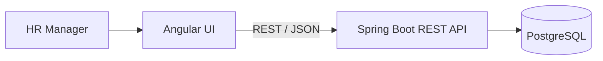
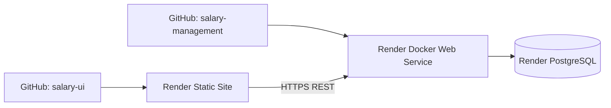

# ACME Employee Salary Management — Architecture

## 1. Architecture Overview

The system is an end-to-end web application consisting of:
- Angular frontend
- Spring Boot REST backend
- PostgreSQL relational database
- Docker-based backend deployment
- Render deployment

The frontend presents employee and salary workflows to the HR Manager, while the backend exposes a REST API and enforces business rules in the service layer. PostgreSQL stores employee and salary data, including historical salary records and the current active salary window for each employee.

The application follows a conventional layered design: controller, service, repository, entity, and persistence. This separation keeps the API contract clear, protects validation logic, and makes the behavior easier to reason about as the codebase grows.

## 2. Backend Structure

The backend follows a standard Spring Boot layered design:
- Controller layer handles HTTP requests and delegates to services.
- Service layer contains business logic, validation, and orchestration.
- Repository layer handles persistence via Spring Data JPA and database queries.
- Entities model the employee and salary domain.

This layering keeps API concerns separate from persistence and makes validation rules easier to enforce consistently across salary and employee operations.

## 3. Employee and Salary Model

Employee and Salary are separate entities because the domain is historical and stateful. An employee is a stable identity; salary data represents compensation over time. Representing the salary history as separate records preserves each pay period without mutating prior records.

Salary has a many-to-one relationship to Employee. The Employee entity does not maintain a bidirectional salary collection. This keeps the employee entity lightweight and avoids unnecessary loading of salary history when an employee view does not need it. Salary records are loaded only when they are required by the salary workflow or analytics service.

Key characteristics:
- Employee records include employee code, name, email, country, department, and job title.
- Salary records include amount, currency, effective-from date, effective-to date, and the associated employee.
- Historical salary records are preserved and never overwritten by the salary management API.
- The current salary is represented by `effectiveTo IS NULL`.
- Salary periods are validated to prevent overlap and invalid ranges.

## 4. Domain Model and Salary Lifecycle

The salary lifecycle is intentionally modeled as a sequence of immutable historical records rather than destructive updates.

A salary record is created when a new pay period begins, and prior salary records remain in the table as historical evidence. This means the system can answer questions such as "what was the employee's pay in 2025?" without losing earlier data.

The active salary is the row where `effectiveTo = null`. When a new salary becomes effective after the current salary, the previous salary is automatically closed one day before the new salary's `effectiveFrom` value. For example:

- 2025-01-01 → 2025-12-31 : USD 70,000
- 2026-01-01 → null        : USD 75,000

This model preserves salary history and avoids destructive updates. It preserves the historical salary record and allows the application to compute compensation trends without re-deriving lost history.

The domain rules are strict:
- Salary periods cannot overlap.
- Salary amount must be positive.
- Currency must be valid.
- A new salary with the same amount and currency as the current salary is rejected.
- The same amount is allowed for historical salaries, and a different currency is allowed.
- Salary operations are transactional so the close of the previous salary and the creation of the new salary occur as one atomic operation.

This is important because a salary change is not just a data write; it changes the active state of an employment compensation record while preserving the full timeline.

## 5. DTO, Validation and Error Handling

The API uses DTOs rather than exposing persistence entities directly. This keeps the public contract stable and prevents internal entity state from leaking into HTTP responses or request payloads.

Validation is split along clear boundaries:
- Request validation: DTO fields and Bean Validation constraints
- Business validation: service-layer checks for lifecycle and domain rules
- Persistence: repository/database operations

This distinction is important. Primitive input issues such as malformed values are caught early with Bean Validation. Business rules such as overlapping dates, invalid currencies, and duplicate active salary state are enforced in the service layer. Repository and persistence concerns remain focused on data access.

Expected application errors are converted into consistent API responses by the application's global exception handling. This keeps client behavior predictable even when a business rule is violated.

## 6. Server-Side Filtering and Pagination

The employee list is intentionally designed for server-side filtering and pagination rather than loading all employees into the Angular client. This matters because the system is expected to support approximately 10,000 employees.

The backend builds dynamic JPA specifications for:
- global search across employee code, first name, last name, full name, and email
- country filtering
- department filtering
- job title filtering

Search is case-insensitive and supports partial matching. Full-name search is supported, and country, department, and job-title filters are applied server-side. Pagination and sorting are performed by the backend database, and page size is bounded so that the API does not return unnecessarily large payloads.

Where appropriate, the data model includes database indexes to support employee search and list access patterns. Client-side filtering was intentionally avoided because it would require full dataset downloads and would not scale well with the expected employee volume.

## 7. Compensation Analytics

Compensation analytics are implemented as backend queries over current salaries only. Aggregation is performed in PostgreSQL rather than in Java memory, which avoids loading all salary rows into the application runtime and keeps the calculation aligned with the database's optimized grouping capabilities.

The analytics service returns dedicated response DTOs for:
- summary statistics
- by-country breakdown
- by-department breakdown
- by-job-title breakdown

The reporting currency defaults to USD and can be changed by the user. Static/deterministic exchange-rate assumptions are used instead of a live FX service. This keeps the assessment deterministic and avoids adding a dependency on an external provider, while also making results reproducible in demos, tests, and seeded environments.

The trade-off is explicit: a production-grade compensation system would typically use an external FX provider with versioned or effective-dated rates, but the assessment scope is intentionally constrained to deterministic, reproducible reporting assumptions.

## 8. Data Seeding and Determinism

The application includes a deterministic seed mechanism for loading a representative dataset at scale. The seed is disabled by default and runs only when configured to do so. This keeps production startup behavior predictable without creating duplicate or unnecessary records.

The seed creates:
- 10,000 employees
- 3 salary records per employee in the seeded dataset
- deterministic and reproducible data
- unique employee codes and emails
- multiple countries, departments, job titles, and currencies
- one current salary per employee
- no overlapping salary periods
- batched persistence for efficient database writes

The seed is designed to mirror real operational shapes while remaining repeatable for development, testing, demos, and performance validation. Deterministic seed data is especially useful when evaluating search, filtering, analytics, and pagination behavior against a realistic dataset without depending on random external data.

## 9. Performance Considerations

The implementation emphasizes backend performance and bounded memory use:
- server-side pagination prevents large list payloads
- database-side aggregation keeps analytics scalable
- database indexes support search and filtering access patterns
- Hibernate/JDBC batching is used during deterministic seed operations
- the salary-to-employee relationship is lazy when appropriate

These measures reflect a practical engineering choice: keep the application scalable for roughly 10,000 employees without moving large datasets into the browser or the application heap. No benchmark guarantees are claimed beyond this design intent.

## 10. API Design

The backend exposes a REST/JSON API grouped around the main domain workflows:
- employee management
- salary management
- compensation analytics

This keeps the client contract aligned with business capabilities and makes the API easier to document and maintain. The application includes OpenAPI/Swagger documentation so the contract can be reviewed in a browser and used by frontend and integration consumers. HTTP-level validation and business errors are reported through consistent API responses, and DTO contracts separate the public API from persistence details.

## 11. Deployment Architecture

The application is deployed as separate runtime components in a conventional cloud setup:

The Angular frontend is deployed as a static site, while the backend is deployed as a Dockerized web service. PostgreSQL provides persistence for employees, salary history, and analytics. This layout keeps the frontend presentation layer separate from backend business logic and database operations while maintaining a straightforward deployment path.

## 12. Engineering Trade-offs

The implementation intentionally favors clarity, operational practicality, and domain correctness over more complex infrastructure. This is appropriate for the assessment scope: it provides maintainability, predictable validation, scalable database-driven filtering and aggregation, and a straightforward path for future extension without introducing unnecessary architectural complexity.
